# Entrypoints & Lifecycle

<- [[00-MOC]] | [[Registries]] | [[Networking]] | [[../04-client-vfx/VFX-core]]

Source prefix: repository root (main branch).

## Main (`JujutsuMod`)

**Source:** `src/main/java/jujutsu/mod/JujutsuMod.java:33-51`
**Status:** VERIFIED

Register order in `onInitialize()`:

1. `JujutsuEntities.register()`
2. `JujutsuDataComponents.register()`
3. `JujutsuItems.register()`
4. `JujutsuParticles.register()`
5. `JujutsuSounds.register()`
6. `JujutsuEffects.register()`
7. `JujutsuNetworking.registerPayloads()`
8. `ProjectJjkRitualRuntime.register()`
9. `ProjectJjkStrawDollRuntime.register()`
10. `NailAnchorLifecycle.register()`
11. `NobaraHammerCombatRuntime.register()`
12. `NobaraActionGuard.register()`
13. `SelfResonanceRuntime.register()`
14. `NailTrapRuntime.register()`
15. `ServerLifecycleEvents.SERVER_STOPPING` -> `CurseLinkRegistry.GLOBAL.clear()`
16. `JujutsuCommands.register()`
17. `ForcedBlackFlash.register()`
18. log initialization

`MOD_ID` is declared at `:29`.

## Client (`JujutsuModClient`)

**Source:** `src/client/java/jujutsu/mod/client/JujutsuModClient.java:17-25`
**Status:** VERIFIED

1. `ProjectJjkStrawDollItem.setRendererFactory(ProjectJjkStrawDollRenderer::provider)` -- GeckoLib straw doll renderer.
2. `EntityRendererRegistry.register(JujutsuEntities.PROJECTJJK_NAIL, ProjectJjkNailRenderer::new)` -- nail entity renderer.
3. `JujutsuClientParticles.registerFactories()` -- particle factories.
4. `VfxDirector.initialize()` -- world callback, HUD callback, client tick, level identity tracking, disconnect/null-level cleanup.
5. `NobaraVfxRecipes.register()` -- all 25 Nobara typed IDs.
6. `JujutsuClientNetworking.registerReceivers()` -- client payload receivers.
7. `JujutsuKeybinds.register()` -- keybinds.

The order ensures recipes exist before `VfxCuePayload` can be received.

## Server tick hooks

**Source:** `ProjectJjkRitualRuntime.java` (END_SERVER_TICK handler)
**Status:** VERIFIED

- `ServerTickEvents.END_SERVER_TICK` resolves ritual pending work and mark expiry.
- Server gameplay resolves first; cue emission is a consequence of confirmed combat, not a client prediction.
- Server lifecycle/disconnect handlers clear gameplay queues and resonance state.

## Client tick / render hooks

| System | Register site | Status |
|---|---|---|
| VFX world geometry | `VfxDirector.initialize` -> `WorldRenderEvents.AFTER_ENTITIES` | VERIFIED |
| VFX HUD | `VfxDirector.initialize` -> `HudElementRegistry` | VERIFIED |
| VFX level-identity transition cleanup | receive/end client tick -> compare `activeLevel` identity -> clear all active instances/channels -> bind current level | VERIFIED |
| VFX lifetime/null-level cleanup | end client tick -> expire by server game time; `level == null` -> clear and reset `activeLevel` | VERIFIED |
| VFX disconnect cleanup | client disconnect -> clear and reset `activeLevel` | VERIFIED |
| Keybinds | `JujutsuKeybinds.register` | VERIFIED |
| Camera/game renderer/first-person mixins | 7 client mixins consume director state | VERIFIED |

Non-expired late cues begin at their actual server-timeline age. Realtime HUD, camera/FOV, and first-person channel timestamps are offset by that age; non-seekable opening beats only run below two ticks. World impacts keep the whole cue and resolve the live entity anchor on every render, falling back to `cue.origin()` if the entity disappears.

## Mermaid -- boot

```mermaid
flowchart TD
  A[Fabric load] --> B[JujutsuMod.onInitialize]
  B --> E[Entities]
  B --> DC[DataComponents]
  B --> I[Items]
  B --> P[Particles]
  B --> S[Sounds]
  B --> FX[Effects]
  B --> N[Networking payloads]
  B --> R[RitualRuntime]
  B --> SD[StrawDollRuntime]
  B --> AL[AnchorLifecycle]
  B --> HC[HammerCombatRuntime]
  B --> AG[ActionGuard]
  B --> SR[SelfResonanceRuntime]
  B --> NT[NailTrapRuntime]
  B --> CL_CURSE[SERVER_STOPPING: CurseLinkRegistry clear]
  B --> CMD[Commands]
  B --> FB[ForcedBlackFlash]
  A --> CL[JujutsuModClient.onInitializeClient]
  CL --> SDR[StrawDoll renderer factory]
  CL --> ER[Nail entity renderer]
  CL --> PF[Particle factories]
  CL --> VD[VfxDirector initialize]
  CL --> NR[Nobara recipes x25]
  CL --> CN[Client receivers]
  CL --> KB[Keybinds]
```

---
tags: #jujutsumod #architecture #lifecycle #vfx #verified
