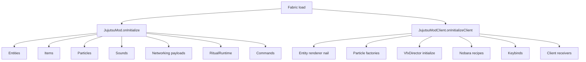

# Entrypoints & Lifecycle

← [[00-MOC]] · [[Registries]] · [[Networking]] · [[../04-client-vfx/VFX-core]]

Prefix: `.worktrees/nobara-cinematic-slice/`

## Main (`JujutsuMod`)

**Source:** `src/main/java/jujutsu/mod/JujutsuMod.java:22-30`  
**Status:** VERIFIED

Register order in `onInitialize()`:

1. `JujutsuEntities.register()`
2. `JujutsuItems.register()`
3. `JujutsuParticles.register()`
4. `JujutsuSounds.register()`
5. `JujutsuNetworking.registerPayloads()`
6. `ProjectJjkRitualRuntime.register()`
7. `JujutsuCommands.register()`
8. log initialization

## Client (`JujutsuModClient`)

**Source:** `src/client/java/jujutsu/mod/client/JujutsuModClient.java:14-22`
**Status:** VERIFIED

1. Register the real ProjectJJK nail entity renderer.
2. Register particle factories.
3. `VfxDirector.initialize()` — one world callback, one HUD callback, client tick, `ClientLevel` identity tracking, and disconnect/null-level cleanup (`VfxDirector.java:25-148`).
4. `NobaraVfxRecipes.register()` — all current Nobara typed IDs.
5. Register keybinds and client payload receivers.

The order ensures recipes exist before `VfxCuePayload` can be received.

## Server tick hooks

**Source:** `ProjectJjkRitualRuntime.java:57-68`
**Status:** VERIFIED

- `ServerTickEvents.END_SERVER_TICK` resolves ritual pending work and mark expiry.
- Server gameplay resolves first; cue emission is a consequence of confirmed combat, not a client prediction.
- Server lifecycle/disconnect handlers clear gameplay queues and resonance state.

## Client tick / render hooks

| System | Register site | Status |
|---|---|---|
| VFX world geometry | `VfxDirector.initialize` → `WorldRenderEvents.AFTER_ENTITIES` | VERIFIED |
| VFX HUD | `VfxDirector.initialize` → `HudElementRegistry` | VERIFIED |
| VFX level-identity transition cleanup | receive/end client tick → compare `activeLevel` identity → clear all active instances/channels → bind current level | VERIFIED |
| VFX lifetime/null-level cleanup | end client tick → expire by server game time; `level == null` → clear and reset `activeLevel` | VERIFIED |
| VFX disconnect cleanup | client disconnect → clear and reset `activeLevel` | VERIFIED |
| Keybinds | `JujutsuKeybinds.register` | VERIFIED |
| Camera/game renderer/first-person mixins | existing mixins consume director state | VERIFIED |

Non-expired late cues begin at their actual server-timeline age. Realtime HUD, camera/FOV, and first-person channel timestamps are offset by that age; non-seekable opening beats only run below two ticks. World impacts keep the whole cue and resolve the live entity anchor on every render, falling back to `cue.origin()` if the entity disappears (`VfxTimeline.java:10-27`; `VfxDirector.java:59-82`; `VfxWorldChannel.java:34-69`; `NobaraVfxRecipes.java:37-189`).

## Mermaid — boot

---
tags: #jujutsumod #architecture #lifecycle #vfx #verified
