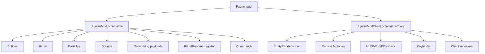

# Entrypoints & Lifecycle

← [[00-MOC]] · [[Registries]] · [[Networking]]

Prefix: `.worktrees/nobara-cinematic-slice/`

## Main (`JujutsuMod`)

**Source:** `src/main/java/jujutsu/mod/JujutsuMod.java:22-30`  
**Status:** VERIFIED

Register order in `onInitialize()`:

1. `JujutsuEntities.register()`
2. `JujutsuItems.register()`
3. `JujutsuParticles.register()`
4. `JujutsuSounds.register()`
5. `JujutsuNetworking.registerPayloads()`
6. `ProjectJjkRitualRuntime.register()`
7. `JujutsuCommands.register()`
8. log `"JujutsuMod initialized"`

Helper: `JujutsuMod.id(path)` → `ResourceLocation.fromNamespaceAndPath(MOD_ID, path)` (`:33-35`).

## Client (`JujutsuModClient`)

**Source:** `src/client/java/jujutsu/mod/client/JujutsuModClient.java:17-`  
**Status:** VERIFIED (header + call order)

1. `EntityRendererRegistry.register(PROJECTJJK_NAIL, ProjectJjkNailRenderer::new)` (`:18`)
2. `JujutsuClientParticles.registerFactories()`
3. `HairpinScreenOverlay.register()`
4. further: world renderer, playback, keybinds, client networking (same method body)

## Server tick hooks

**Source:** `ProjectJjkRitualRuntime.register` `:46-56`  
**Status:** VERIFIED

- `ServerTickEvents.END_SERVER_TICK` → `onServerTick` (`:58`)
  - `tickHairpinTasks(gameTime)` (`:234`)
  - every 64 ticks: `ProjectJjkNailMarks.pruneExpired`
- `ServerLifecycleEvents.SERVER_STOPPING` clears pending queues
- `ServerPlayConnectionEvents.DISCONNECT` clears resonance link

## Client tick / render hooks (symbols)

| System | Register site | Status |
|---|---|---|
| Hairpin playback tick | `HairpinPlaybackManager` via client init | VERIFIED path |
| Screen overlay HUD | `HairpinScreenOverlay.register` `:21` | VERIFIED |
| World render after entities | `HairpinWorldRenderer.register` `:52` | VERIFIED |
| Keybinds end client tick | `JujutsuKeybinds.register` `:14` | VERIFIED |
| Camera/render mixins | `jujutsumod.client.mixins.json` | VERIFIED |

## Mermaid — boot

---
tags: #jujutsumod #architecture #lifecycle
