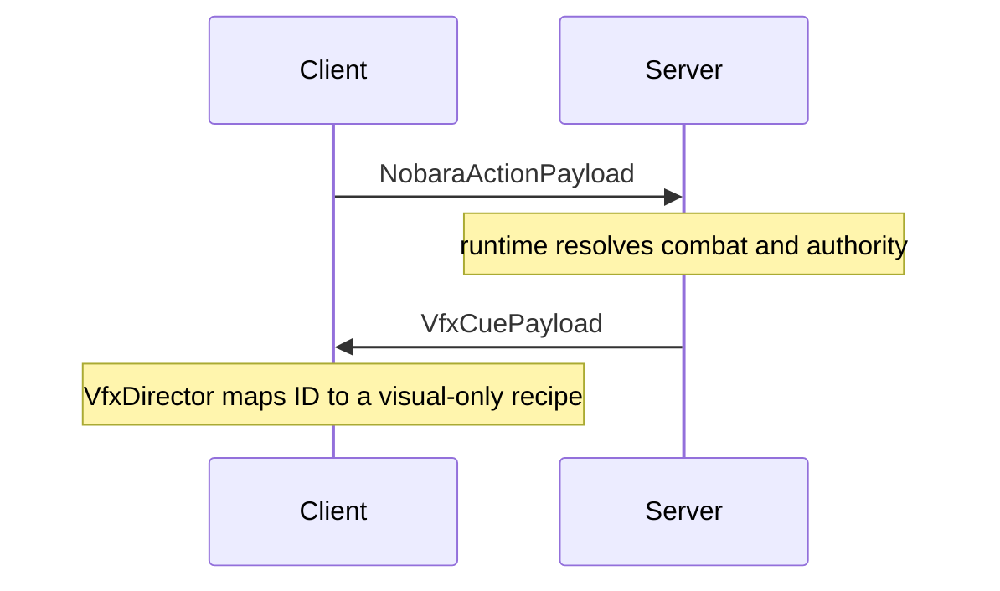

# Networking

<- [[00-MOC]] | [[Client-server-boundaries]] | [[../04-client-vfx/VFX-core]] | [[../05-reference/Claim-Source-Index]]

Source prefix: repository root (main branch).

## Registration

**Source:** `src/main/java/jujutsu/mod/network/JujutsuNetworking.java:17-26`
**Status:** VERIFIED

| Direction | Payload | Register line | Purpose | Status |
|---|---|---|---|---|
| S2C | `VfxCuePayload` | `:18` | one typed visual cue: ID, origin, optional anchor, intensity, server time, seed | VERIFIED |
| S2C | `CharacterSelectionSyncPayload` | `:19` | selected character sync to client render/UI | VERIFIED |
| C2S | `SelectCharacterPayload` | `:20` | GUI character choice | VERIFIED |
| C2S | `NobaraActionPayload` | `:21` | R/B/left-click Nobara action request | VERIFIED |
| S2C | `CurseLinkOptionsPayload` | `:22` | identities offered for an ambiguous self-resonance selection | VERIFIED |
| C2S | `SelectCurseLinkPayload` | `:23` | selected link id; never a damage authorization | VERIFIED |
| S2C | `BlackFlashFocusPayload` | `:24` | authoritative focus-tag mirror for the local client | VERIFIED |

Removed S2C VFX payloads: `ProjectJjkNobaraImpulsePayload`, `HairpinFxPayload`, `HairpinNailFlightPayload`, and `PreparedNailsPayload`. `ProjectSanityTest` guards the core migration.

## Server receivers

**Source:** `JujutsuNetworking.java:28-37`

| Payload | Server path | Line | Status |
|---|---|---|---|
| `SelectCharacterPayload` | `CharacterSelectionManager.select(context.player(), JujutsuCharacter.byId(...))` | `:29-30` | VERIFIED |
| `NobaraActionPayload` | `ProjectJjkNobaraActions.tryCast(player, payload.action(), true)` | `:31-32` | VERIFIED |
| `SelectCurseLinkPayload` | `SelfResonanceRuntime.select(player, payload.linkId())` | `:33-34` | VERIFIED |

Connection lifecycle:

- join -> `CharacterSelectionManager.syncTo(handler.player)` + `BlackFlashFocus.sync(handler.player)` (`:35`)
- disconnect -> `CharacterSelectionManager.clear(handler.player)` (`:36`)

## VFX cue broadcast

| Method | Source | Pattern | Status |
|---|---|---|---|
| `broadcastVfxCue` | `JujutsuNetworking.java:43-57` | distance-squared radius filter + `ServerPlayNetworking.canSend` | VERIFIED |
| `sendVfxCue` | `JujutsuNetworking.java:59-65` | direct send gated by `canSend` | VERIFIED |

The server decides whether and when a cue exists. The payload has no gameplay receiver on the client.

## Client receivers

**Source:** `src/client/java/jujutsu/mod/client/network/JujutsuClientNetworking.java:17-27`
**Status:** VERIFIED

| Payload | Client path | Line | Status |
|---|---|---|---|
| `VfxCuePayload` | schedule `VfxDirector.receive(payload.cue())` | `:18-19` | VERIFIED |
| `CharacterSelectionSyncPayload` | `ClientCharacterSelectionManager.apply` | `:20-21` | VERIFIED |
| `CurseLinkOptionsPayload` | opens `CurseLinkSelectionScreen` | `:22-23` | VERIFIED |
| `BlackFlashFocusPayload` | `ClientBlackFlashFocus.apply` | `:24-25` | VERIFIED |

Client disconnect cleanup (`:26`): clears `ClientCharacterSelectionManager` and `ClientBlackFlashFocus`.

The receiver deliberately contains no effect-ID switch. `VfxDirector` finds a registered Java recipe or logs/ignores an unknown ID once.

## Mermaid

## Combat payload rules

`NobaraActionPayload` has only a numeric action request. It does not carry target, timing, damage, or anchor data. `SelectCurseLinkPayload` carries only an id; the server requires current participant membership and ambiguity before keeping it. `BlackFlashFocusPayload` is server-to-client state mirroring only. The menu and focus cache cannot authorize gameplay.

| Risk | Status | Source |
|---|---|---|
| A client outside the broadcast radius sees no local composition | VERIFIED design constraint | `broadcastVfxCue` callers + radius filter |
| `canSend` false silently skips a client | VERIFIED | `JujutsuNetworking.java:51,60` |
| ID emitted by a server but not registered by a client is ignored safely | VERIFIED | `VfxDirector.java` unknown-ID warn-once |
| Recipe/ID drift needs explicit guard coverage | MITIGATED | `ProjectSanityTest` registration assertions |

---
tags: #jujutsumod #networking #vfx #verified
