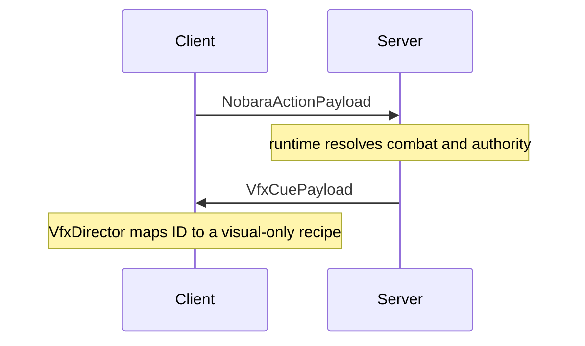

# Networking

← [[00-MOC]] · [[Client-server-boundaries]] · [[../04-client-vfx/VFX-core]] · [[../05-reference/Claim-Source-Index]]

Prefix: `.worktrees/nobara-cinematic-slice/`

## Registration

**Source:** `src/main/java/jujutsu/mod/network/JujutsuNetworking.java:17-23`
**Status:** VERIFIED

| Direction | Payload | Register source | Purpose | Status |
|---|---|---|---|---|
| S2C | `VfxCuePayload` | `JujutsuNetworking.java:15` | one typed visual cue: ID, origin, optional anchor, intensity, server time, seed | VERIFIED |
| S2C | `CharacterSelectionSyncPayload` | `JujutsuNetworking.java:16` | selected character sync to client render/UI | VERIFIED |
| C2S | `SelectCharacterPayload` | `JujutsuNetworking.java:17` | GUI character choice | VERIFIED |
| C2S | `NobaraActionPayload` | `JujutsuNetworking.java:18` | R/B/left-click Nobara action request | VERIFIED |
| S2C | `CurseLinkOptionsPayload` | `JujutsuNetworking.java:19` | identities offered for an ambiguous self-resonance selection | VERIFIED |
| C2S | `SelectCurseLinkPayload` | `JujutsuNetworking.java:20` | selected link id; never a damage authorization | VERIFIED |
| S2C | `BlackFlashFocusPayload` | `JujutsuNetworking.java:21` | authoritative focus-tag mirror for the local client | VERIFIED |

Removed S2C VFX payloads: `ProjectJjkNobaraImpulsePayload`, `HairpinFxPayload`, `HairpinNailFlightPayload`, and `PreparedNailsPayload`. `ProjectSanityTest.java:357-362` guards the core migration; old legacy guards remain in the same test.

## Server receivers

| Payload | Server path | Source | Status |
|---|---|---|---|
| `SelectCharacterPayload` | `CharacterSelectionManager.select(context.player(), JujutsuCharacter.byId(...))` | `JujutsuNetworking.java:26-28` | VERIFIED |
| `NobaraActionPayload` | `ProjectJjkNobaraActions.tryCast(player, payload.action(), true)` | `JujutsuNetworking.java:31-35` | VERIFIED |
| `SelectCurseLinkPayload` | `SelfResonanceRuntime.select(player, payload.linkId())` | `JujutsuNetworking.java:24-26` | VERIFIED |

Connection lifecycle:

- join → `CharacterSelectionManager.syncTo(handler.player)`
- join → `BlackFlashFocus.sync(handler.player)`
- disconnect → `CharacterSelectionManager.clear(handler.player)`

## VFX cue broadcast

| Method | Source | Pattern | Status |
|---|---|---|---|
| `broadcastVfxCue` | `JujutsuNetworking.java:38-51` | distance-squared radius filter + `ServerPlayNetworking.canSend` | VERIFIED |
| `sendVfxCue` | `JujutsuNetworking.java:54-59` | direct send gated by `canSend` | VERIFIED |

The server decides whether and when a cue exists. The payload has no gameplay receiver on the client.

## Client receivers

**Source:** `src/client/java/jujutsu/mod/client/network/JujutsuClientNetworking.java:13-19`
**Status:** VERIFIED

| Payload | Client path | Source | Status |
|---|---|---|---|
| `VfxCuePayload` | schedule `VfxDirector.receive(payload.cue())` | `JujutsuClientNetworking.java:14-15` | VERIFIED |
| `CharacterSelectionSyncPayload` | `ClientCharacterSelectionManager.apply` | `JujutsuClientNetworking.java:16-17` | VERIFIED |
| `CurseLinkOptionsPayload` | opens `CurseLinkSelectionScreen` | `JujutsuClientNetworking.java:20-22` | VERIFIED |
| `BlackFlashFocusPayload` | `ClientBlackFlashFocus.apply` | `JujutsuClientNetworking.java:23-25` | VERIFIED |

The receiver deliberately contains no effect-ID switch. `VfxDirector` finds a registered Java recipe or logs/ignores an unknown ID once.

## Mermaid

## Combat payload rules

`NobaraActionPayload` has only a numeric action request. It does not carry target, timing, damage, or anchor data. `SelectCurseLinkPayload` carries only an id; the server requires current participant membership and ambiguity before keeping it. `BlackFlashFocusPayload` is server-to-client state mirroring only. The menu and focus cache cannot authorize gameplay.

| Risk | Status | Source |
|---|---|---|
| A client outside the broadcast radius sees no local composition | VERIFIED design constraint | `broadcastVfxCue` callers + radius filter |
| `canSend` false silently skips a client | VERIFIED | `JujutsuNetworking.java:46-48,55-57` |
| ID emitted by a server but not registered by a client is ignored safely | VERIFIED | `VfxDirector.java:61-67` |
| Recipe/ID drift needs explicit guard coverage | MITIGATED | `ProjectSanityTest.java:353-356` |

---
tags: #jujutsumod #networking #vfx #verified
