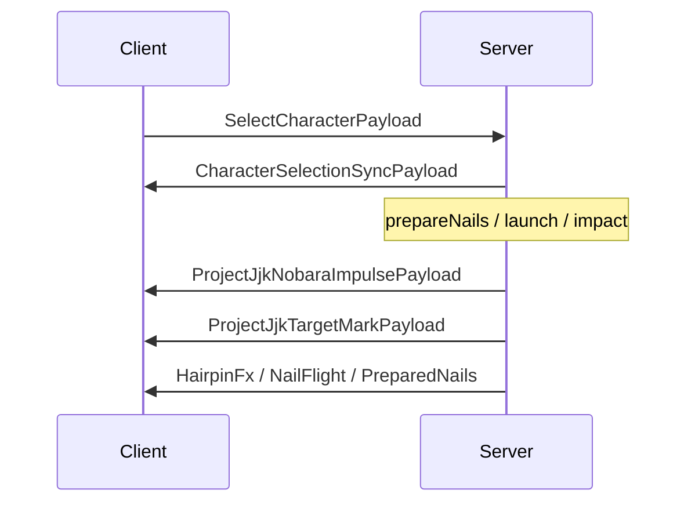

# Networking

← [[00-MOC]] · [[Client-server-boundaries]]

Prefix: `.worktrees/nobara-cinematic-slice/`

## Registration

**Source:** `src/main/java/jujutsu/mod/network/JujutsuNetworking.java:16-`  
**Status:** VERIFIED

### S2C payloads registered

| Payload | Register line (approx) | Purpose |
|---|---|---|
| `HairpinFxPayload` | `:17` | cinematic hairpin FX scene |
| `HairpinNailFlightPayload` | `:18` | nail flight VFX |
| `PreparedNailsPayload` | `:19` | prepared nail row sync |
| `ProjectJjkNobaraImpulsePayload` | `:20` | semantic combat impulses (impact/enlarge/explosion/resonance) |
| `ProjectJjkTargetMarkPayload` | `:21` | mark count + expiry on target |
| `CharacterSelectionSyncPayload` | (same file / character path) | character selection broadcast |

### C2S

| Payload | Purpose |
|---|---|
| `SelectCharacterPayload` | client → server choose character |

**Record defs:**  
`network/*Payload.java` (7 records).  
Examples: `SelectCharacterPayload.java:8`, `ProjectJjkTargetMarkPayload.java:8`, `HairpinFxPayload.java:8`.

## Broadcast pattern

Methods in `JujutsuNetworking`:

| Method | Source | Pattern |
|---|---|---|
| `broadcastHairpin` | `:42-57` | radius + `canSend` per player |
| `broadcastNailFlight` | `:59-72` | same |
| `broadcastPreparedNails` | `:74-87` | same |
| `broadcastProjectJjkImpulse` | `:89-102` | same |
| `broadcastProjectJjkTargetMark` | `:112-125` | same |

All use distance-squared filter + `ServerPlayNetworking.canSend`.

## Client receivers

**Source:** `src/client/java/jujutsu/mod/client/network/JujutsuClientNetworking.java:32` `registerReceivers`

Handlers include:

- ProjectJJK impulse → impact / resonance / enlarge / explosion (`:64-153`)
- Hairpin FX / nail flight / prepared nails / target marks / character sync

## Character select C2S

- Client: `CharacterSelectScreen` sends `SelectCharacterPayload`
- Server: registered receiver → `CharacterSelectionManager.select`
- S2C: `CharacterSelectionSyncPayload` (`CharacterSelectionManager.java:52-53`)

## Mermaid

## Risks

| Risk | Status | Source |
|---|---|---|
| Radius filter desync if clients far | INFERRED | broadcast radius constants in runtime |
| Impulse kind enum drift client/server | INFERRED | single payload multi-kind |
| canSend false silent skip | VERIFIED | log paths in hairpin broadcast `:53` |

---
tags: #jujutsumod #networking
