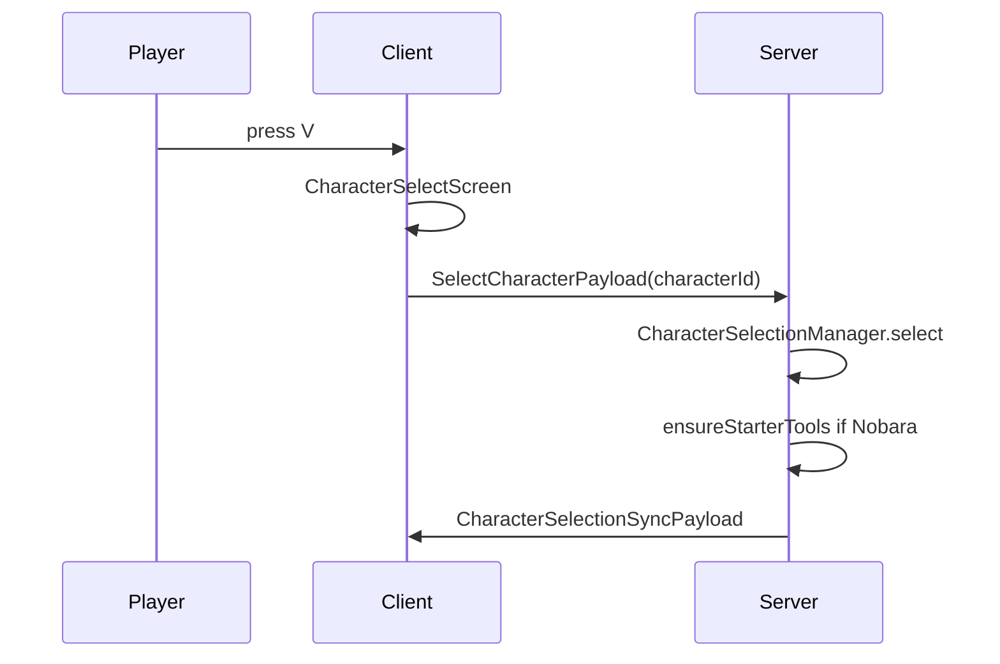

# Character Selection

← [[00-MOC]] · [[04-client-vfx/GUI-character-select]]

Prefix: `.worktrees/nobara-cinematic-slice/`

## Characters

**Source:** `src/main/java/jujutsu/mod/character/JujutsuCharacter.java`

| Enum | id | modelId | Status |
|---|---|---|---|
| NONE | `none` | `wide` | VERIFIED |
| NOBARA | `nobara` | `wide` | VERIFIED |

## Server manager

**Source:** `CharacterSelectionManager.java`

| Method | Lines | Behavior | Status |
|---|---|---|---|
| `select` | `:17-27` | store map; if NOBARA → `ProjectJjkNobaraLoadout.ensureStarterTools`; broadcast sync | VERIFIED |
| `syncTo` | `:29-33` | send all selections to joining player | VERIFIED |
| `clear` | `:35-40` | remove + broadcast NONE | VERIFIED |
| `send` | `:51-54` | `CharacterSelectionSyncPayload` if canSend | VERIFIED |

## Client

| Piece | Source | Status |
|---|---|---|
| Keybind V | `JujutsuKeybinds.java:14+` category `key.categories.jujutsumod` | VERIFIED |
| Screen | `CharacterSelectScreen` extends `UiScreen` | VERIFIED |
| Client selection cache | `ClientCharacterSelectionManager` | VERIFIED path |
| Skin | `CharacterSkinMixin` | VERIFIED listed in mixins json |

## Network

## Loadout

On select NOBARA: `ProjectJjkNobaraLoadout.ensureStarterTools(player)`  
**Status:** VERIFIED call site `CharacterSelectionManager.java:23-25`

---
tags: #jujutsumod #character
