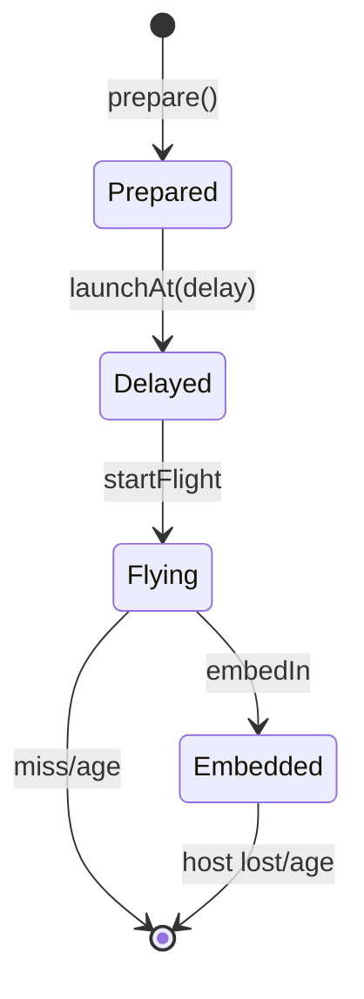

# Nail Entity Lifecycle

← [[00-MOC]] · entity `ProjectJjkNailEntity`

**Source file:** `.worktrees/nobara-cinematic-slice/src/main/java/jujutsu/mod/character/nobara/projectjjk/ProjectJjkNailEntity.java` (417 lines)

## Synced state

**Source:** `:25-30`  
**Status:** VERIFIED

| Data | Meaning |
|---|---|
| DATA_FLYING | in flight |
| DATA_EMBEDDED | stuck in living |
| DATA_FORWARD | flight/face direction |
| DATA_EMBEDDED_TARGET_ID | host entity id |
| DATA_EMBEDDED_LOCAL_OFFSET / FORWARD | local attach frame |

## Phases

| Phase | Methods | Lines | Status |
|---|---|---:|---|
| Prepare | `prepare` | 69 | VERIFIED |
| Launch schedule | `launchAt` | 79 | VERIFIED |
| Flight | `startFlight` / tick flying | 321 / 133 | VERIFIED |
| Impact | via runtime `resolveNailImpact` → `embedIn` | 283 | VERIFIED |
| Embedded tick | `tickEmbedded` | 301 | VERIFIED |
| Cleanup | age / discard helpers in ritual | entity max age Profile 1200 | VERIFIED constant |

## Key behaviors

### prepare (`:69`)

Sets owner, position, prepared flag, direction.

### launchAt (`:79`)

Stores target + delay ticks; later starts flight velocity `LAUNCH_SPEED_BLOCKS_PER_TICK` (`Profile:13`, `launchVelocity:364`).

### embedIn (`:283`)

Attaches to living, syncs local offset, marks embedded.

### tickEmbedded (`:301`)

Follows target; discards if host dead/missing (logic in method body).

### Collision / pick

- `isPickable` / `getPickRadius` (`:189-194`)
- `canHitEntity` (`:334`) skips owner etc.

## Edge cases (code-backed)

| Case | Status | Notes |
|---|---|---|
| Max age 1200 ticks | VERIFIED | `Profile.MAX_NAIL_AGE_TICKS:9` |
| Embedded age = mark duration 900 | VERIFIED | `EMBEDDED_NAIL_AGE_TICKS:26` |
| Stagger delay 4 ticks × index | VERIFIED | `launchDelayForIndex:73-75` |
| Prepared nails must be found in radius for launch | VERIFIED | `findPreparedNails` runtime |

## Render

Client: `ProjectJjkNailRenderer` + item model; flying/embedded state from entity data.  
See [[04-client-vfx/Nail-rendering]].

---
tags: #jujutsumod #nail
