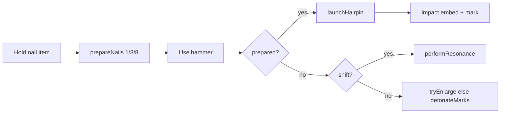

# Nobara Overview

← [[00-MOC]] · detail: [[Nobara-runtime-flow]] · [[Nail-entity-lifecycle]] · [[Target-marks-and-resonance]]

## One-line fantasy

Item-driven Straw Doll kit: charge nails → launch with hammer → marks → detonate / enlarge / remote resonance.

## Combat loop

## Items (default = ProjectJJK classes)

| Item id | Behavior class | Source | Status |
|---|---|---|---|
| hairpin_nail / projectjjk_hairpin_nail | `ProjectJjkNailItem` | `JujutsuItems.java:12-14` | VERIFIED |
| straw_doll_hammer / projectjjk_straw_doll_hammer | `ProjectJjkHammerItem` | `:13-15` | VERIFIED |

### Nail use

**Source:** `ProjectJjkNailItem.java`  
- `use` → start using (bow anim)  
- `releaseUsing` → `ProjectJjkNobaraRuntime.prepareNails(player, stack, useTicks)`  
**Status:** VERIFIED

### Hammer use

**Source:** `ProjectJjkHammerItem.java`  
- Shift → `performResonance`  
- Else → `launchHairpin`; if launched → `detonateMarks`; else → `tryEnlarge` then `detonateMarks`  
**Status:** VERIFIED

## Balance constants

**Source:** full file `ProjectJjkNobaraProfile.java:4-75`  
**Status:** VERIFIED  

Highlights:

| Constant | Value |
|---|---|
| TRIPLE_HOLD_TICKS / BARRAGE | 6 / 16 |
| nails 1/3/8 | SINGLE/TRIPLE/BARRAGE |
| NAIL_DAMAGE / HAIRPIN_DAMAGE | 2 / 18 |
| MARK_MAX / DURATION | 4 / 900 ticks |
| DETONATE base+per mark | 4 + 5*marks |
| ENLARGE delay/stun/dmg | 20t / 50t / 18 |
| RESONANCE range/link | 96 / 32 |
| RESONANCE dmg | 8 + 3*marks |

## Deviations from ProjectJJK (high level)

| Topic | Ours | ProjectJJK | Parity |
|---|---|---|---|
| Delivery | items + entity | ability hotbar + CE | DIFFERENT |
| Cursed energy | none in kit | full CE economy | MISSING/DIFFERENT |
| Body part remains | not present | ResonantRemains passive | MISSING |
| Nail barrage count | 8 | 10 in piercing_nail hold | DIFFERENT |
| Marks | UUID stack server map | ITE glow + ability marks | INSPIRED |

See [[05-reference/ProjectJJK-parity-map]].

## Dual stack note

Legacy cinematic Hairpin path (`NobaraHairpinRuntime`, `HairpinFxPayload` timeline) coexists for VFX showcase/commands. Default gameplay items route through **projectjjk** package.

**Status:** INFERRED architecture / VERIFIED item class wiring.

---
tags: #jujutsumod #nobara
