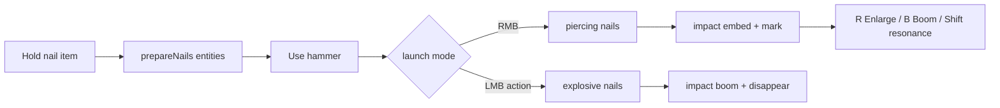

# Nobara Overview

← [[00-MOC]] · detail: [[Nobara-runtime-flow]] · [[Nail-entity-lifecycle]] · [[Target-marks-and-resonance]]

## One-line fantasy

ProjectJJK-style Straw Doll kit: charge real nail entities → strike with hammer → embed marks → detonate / enlarge / remote resonance.

## Canonical implementation

The old jujutsumod cinematic Nobara stack has been removed. ProjectJJK Nobara is now the only runtime path.

| Area | Current source | Status |
|---|---|---|
| Runtime package | `src/main/java/jujutsu/mod/character/nobara/projectjjk/` | VERIFIED |
| Main item ids | `hairpin_nail`, `straw_doll_hammer` | VERIFIED |
| Item classes | `ProjectJjkNailItem`, `ProjectJjkHammerItem` | VERIFIED |
| Network payloads | `VfxCuePayload`, `NobaraActionPayload`, character selection sync/select | VERIFIED |
| Removed legacy classes | `NobaraHairpinRuntime`, `NobaraCombatStateManager`, `HairpinGameplayService`, legacy Hairpin payloads/playback | VERIFIED |

Source: `src/test/java/jujutsu/mod/ProjectSanityTest.java:159-188`.

## Combat loop

## Items

| Item id | Behavior class | Source | Status |
|---|---|---|---|
| `hairpin_nail` | `ProjectJjkNailItem` | `JujutsuItems.java:12` | VERIFIED |
| `straw_doll_hammer` | `ProjectJjkHammerItem` | `JujutsuItems.java:13` | VERIFIED |
| `projectjjk_hairpin_nail` | alias to same ProjectJJK item class | `JujutsuItems.java:14` | VERIFIED |
| `projectjjk_straw_doll_hammer` | alias to same ProjectJJK item class | `JujutsuItems.java:15` | VERIFIED |

Default item definitions render with the ProjectJJK models, not the removed legacy item models. Source: `ProjectSanityTest.java:195-199`.

## Current balance note

Current R/B finisher damage is tuned for vanilla smoke testing rather than strict ProjectJJK parity:

- Hairpin Enlarge: `16.0f`
- Hairpin Explosion / Boom: `12.0f` fixed, no mark scaling

Source: `ProjectSanityTest.java:229-234`; implementation source `ProjectJjkNobaraProfile.java`.

## Removed legacy stack

The following were removed in the cleanup pass:

- Legacy runtime/items: `NobaraHairpinRuntime`, `NobaraCombatStateManager`, `HairpinGameplayService`, `HairpinNailItem`, `StrawDollHammerItem`
- Legacy networking: removed `ProjectJjkNobaraImpulsePayload`, `HairpinFxPayload`, `HairpinNailFlightPayload`, and `PreparedNailsPayload`
- Removed legacy client playback: `HairpinPlayback`, `HairpinPlaybackManager`, `NobaraNailFlightManager`, `HairpinTimeline`, `HairpinVisualProfile`
- Legacy assets: old item models/textures and old unused Hairpin post-shaders

Regression guard: `ProjectSanityTest.java:159-188`.

---
tags: #jujutsumod #nobara #projectjjk #verified
