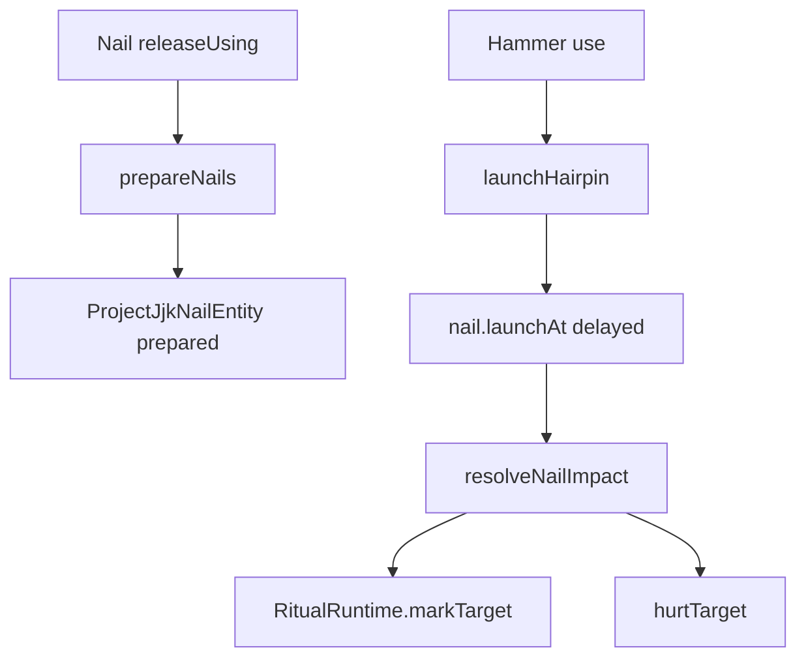
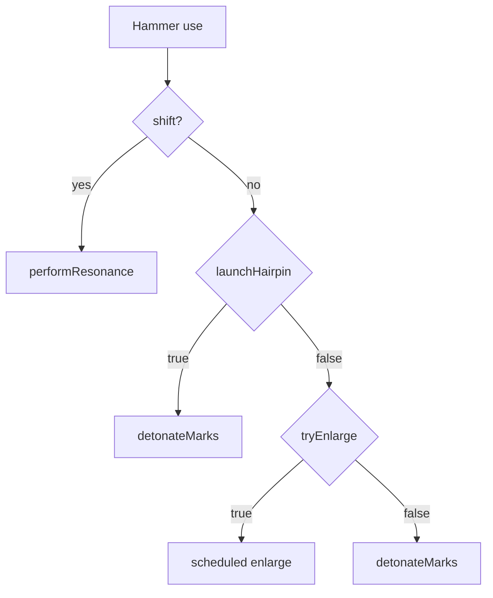

# Nobara Runtime Flow

← [[00-MOC]] · [[Nobara-overview]]

Prefix: `.worktrees/nobara-cinematic-slice/src/main/java/jujutsu/mod/character/nobara/projectjjk/`

## `ProjectJjkNobaraRuntime`

| Method | Line | Role | Status |
|---|---:|---|---|
| `prepareNails` | 34 | count nails by hold ticks; consume; spawn prepared entities; particles/sounds | VERIFIED |
| `launchHairpin` | 65 | find prepared nails; target resolve; stagger launch delays; hammer SFX; impulse broadcast | VERIFIED |
| `resolveNailImpact` | 97 | damage, area, embed mark, impact particles/impulse | VERIFIED |
| helpers | 151+ | particles, find prepared, consume, hammer damage | VERIFIED |

### prepareNails logic (verified)

1. `nailCountForUseTicks(useTicks)` → 1 / 3 / 8 (`Profile:63-71`)
2. creative vs inventory count (`:37-39`)
3. consume nails if survival (`:44-46`)
4. row positions `preparedRow` (`:202`)
5. each: `nail.prepare(player, pos, look)` + warn/ignition/soul flame particles (`:50-58`)

### launchHairpin logic (verified)

1. `findPreparedNails` — empty → false (`:67-70`)
2. `TargetResolver.resolve(..., TARGET_RANGE 36)` (`:72`)
3. staggered `nail.launchAt(targetPoint, launchDelayForIndex)` (`:76-82`)
4. multi-sound forge/snap (`:85-91`)
5. `broadcastProjectJjkImpulse` HAMMER kind (`:92`)
6. damage hammer durability (`:93`)

## `ProjectJjkRitualRuntime`

| Method | Line | Role | Status |
|---|---:|---|---|
| `register` | 46 | server tick + cleanup + disconnect | VERIFIED |
| `markTarget` | 69/74 | marks apply + target mark payload + particles | VERIFIED |
| `performResonance` | 92 | bind if unbound; else remote strike | VERIFIED |
| `tryEnlargeMarkedTarget` | 147 | schedule enlarge | VERIFIED |
| `detonateMarks` | 170 | schedule explosions from anchors | VERIFIED |
| `tickHairpinTasks` | 234 | resolve pending enlarge/explosions | VERIFIED |
| `explodeAnchor` | 287 | damage + VFX impulse | VERIFIED |

### Pending queues

**Source:** `:40-41`  
- `PENDING_EXPLOSIONS`  
- `PENDING_ENLARGES`  

Cleared on server stop; processed each tick via `tickHairpinTasks`.

## Target resolve

**Source:** `combat/TargetResolver.java`  
Used for launch aim and marked target search helpers.  
Tests: `TargetResolverTest`.

## Mermaid — launch

## Mermaid — hammer fallback

---
tags: #jujutsumod #runtime
