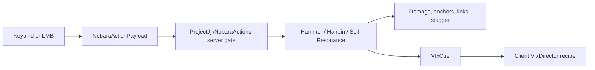

# Nobara Runtime Flow

← [[00-MOC]] · [[Nobara-overview]] · [[Nail-entity-lifecycle]] · [[Combat-timing-and-black-flash]] · [[Curse-links]] · [[Straw-Doll-resonance]]

**Source prefix:** `.worktrees/nobara-cinematic-slice/src/main/java/jujutsu/mod/character/nobara/projectjjk/`

## Authority boundary

The client only sends a compact `NobaraActionPayload` or an explicit link selection. `JujutsuNetworking` queues the receiver on the server, and `ProjectJjkNobaraActions` rejects a non-Nobara selection or an active stagger before choosing a runtime. Damage, anchor lifecycle, timing, target validation, link validation, and VFX emission are server-owned.

**Source:** `JujutsuNetworking.java:15-35`, `ProjectJjkNobaraActions.java:11-37`, `JujutsuClientNetworking.java:17-30`. **Status:** VERIFIED.

## Nail preparation and impact

`ProjectJjkNailItem` starts item use and calls `ProjectJjkNobaraRuntime.tickPreparing` on each server use tick. The profile converts hold duration to one initial nail plus one every 10 ticks, capped at eight. `ProjectJjkNailEntity` owns delayed flight, entity/block embedding, typed anchor persistence, and the ordinary nail-hit path. See [[Nail-entity-lifecycle]].

The ordinary impact path can create a target mark/remnant progression, but explosive and self-directed hits are excluded from that ordinary-hit rule. The distinct Straw Doll ritual is documented in [[Straw-Doll-resonance]].

## Hairpin

`ProjectJjkRitualRuntime.tryEnlargeMarkedTarget` requires a valid marked looked-at target and queues the selected owned embedded nails. Its tick path retries a temporarily unavailable anchor and drops only terminal entries. `detonateMarks` gathers concrete owned nails, consumes their marks, and resolves Boom in small batches after the configured delay. Both routes emit semantic VFX cues and apply independent `hairpin` damage per nail.

| Action | Initial damage | Timing | Source |
|---|---:|---|---|
| Enlarge | 4 per nail | 20-tick delay | `ProjectJjkNobaraProfile.java:33-38`; `ProjectJjkRitualRuntime.java:95-120,191-251` |
| Boom | 3 per nail | starts after 10 ticks, staged batches | `ProjectJjkNobaraProfile.java:28-32`; `ProjectJjkRitualRuntime.java:122-142,191-279` |

## Hammer and Black Flash

The LMB request first consumes an active Black Flash window. Otherwise the runtime prefers a nearby prepared nail launch, then an embedded-nail drive on the looked-at target, then alternates horizontal and overhead hammer attacks. Delayed impacts use `NobaraActionTimeline`; a valid impact opens a 0..2 tick Black Flash input window. A successful second input adds only the multiplier bonus, applies heavy stagger, emits `BLACK_FLASH`, and grants a persistent player-tag focus synchronized to the local client.

The Fabric attack callback suppresses vanilla entity damage for the Nobara hammer, preventing a second vanilla hit beside the server runtime. See [[Combat-timing-and-black-flash]].

## Self Resonance

Shift+R routes through `SelfResonanceRuntime`. It reads explicit `CurseLinkRegistry` entries for the player: one link is used directly; zero reports failure; two or more send a menu payload and require a separate selected-link confirmation. At the windup impact, the server first applies the dedicated self-resonance damage to the caster. Only if that succeeds are linked loaded living participants damaged, heavily staggered, and sent target VFX. See [[Curse-links]].

## Runtime registration

`JujutsuMod.onInitialize` registers the ritual, doll, anchor lifecycle, hammer runtime, action guard, self resonance, networking, and command entrypoints. Server stop clears curse links; each stateful runtime has its own server-stop cleanup.

**Source:** `JujutsuMod.java:23-43`, `NobaraHammerCombatRuntime.java:30-34`, `SelfResonanceRuntime.java:27-31`. **Status:** VERIFIED.

---
tags: #jujutsumod #runtime #nobara #verified
