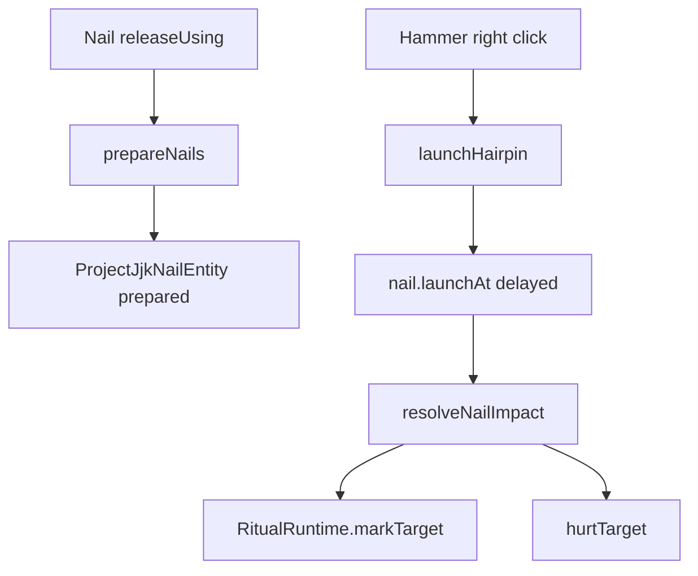
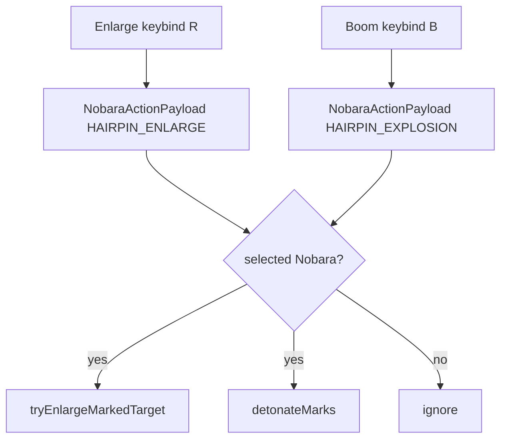

# Nobara Runtime Flow

← [[00-MOC]] · [[Nobara-overview]] · [[Target-marks-and-resonance]] · [[Straw-Doll-resonance]]

Prefix: `.worktrees/nobara-cinematic-slice/src/main/java/jujutsu/mod/character/nobara/projectjjk/`

## `ProjectJjkNobaraRuntime`

| Method | Line | Role | Status |
|---|---:|---|---|
| `prepareNails` | 39-66 | count nails by hold ticks; consume; spawn prepared entities; particles/sounds | VERIFIED |
| `launchHairpin` | 84-115 | find prepared nails; target resolve; stagger launch delays; hammer SFX; typed `hammer` cue | VERIFIED |
| `resolveNailImpact` | 141-190 | server damage/mark resolution, accepted ordinary-hit remnant progress, plus typed `impact` / direct `impact_sound` cues | VERIFIED |
| helpers | 191+ | server particles, prepared-nail lookup, inventory use, hammer damage | VERIFIED |

### prepareNails logic

1. `nailCountForUseTicks(useTicks)` grows from 1 to a cap of 8 (`ProjectJjkNobaraProfile.java:64-66`).
2. Creative versus inventory availability is resolved at `ProjectJjkNobaraRuntime.java:42-44`.
3. Survival nails are consumed at `ProjectJjkNobaraRuntime.java:49-51`.
4. `preparedRow` supplies entity positions at `ProjectJjkNobaraRuntime.java:54-55`.
5. Each real nail entity receives compressed-energy pressure feedback; old blue-fire/ignition composition is absent.

### launchHairpin logic

1. `findPreparedNails` empty returns false (`ProjectJjkNobaraRuntime.java:86-89`).
2. Target resolution uses the 36-block profile range (`ProjectJjkNobaraRuntime.java:91`, `ProjectJjkNobaraProfile.java:14`).
3. `nail.launchAt(..., launchDelayForIndex, explosiveImpact)` staggers real nail entities (`ProjectJjkNobaraRuntime.java:95-103`).
4. Forge/anvil/snap SFX remain server-authoritative (`ProjectJjkNobaraRuntime.java:106-111`).
5. The server broadcasts `NobaraVfxIds.HAMMER` with a player anchor (`ProjectJjkNobaraRuntime.java:112-113`).
6. Hammer durability is applied after the cue (`ProjectJjkNobaraRuntime.java:114`).

An ordinary direct impact advances marks/remnant progress only when `hurtServer` accepted the damage and the hit is neither explosive nor self-directed (`ProjectJjkNobaraRuntime.java:148-153,280-294`; `ProjectJjkRitualPolicy.java:45-47`).

## `ProjectJjkHammerItem`

The hammer no longer hides Hairpin Enlarge/Boom fallback behavior.

| Input | Runtime call | Source | Status |
|---|---|---|---|
| right click | `ProjectJjkNobaraRuntime.launchHairpin` | `ProjectJjkHammerItem.java:17-27` | VERIFIED |
| shift + right click | `ProjectJjkStrawDollRuntime.tryStart` | `ProjectJjkHammerItem.java:20-24` | VERIFIED |

## `ProjectJjkRitualRuntime`

| Method | Line | Role | Status |
|---|---:|---|---|
| `register` | 57-68 | server tick + stopping/disconnect cleanup | VERIFIED |
| `markTarget` | 87-96 | marks, vanilla Glowing/cyan team, server particles/sound; no mark payload | VERIFIED |
| `tryEnlargeMarkedTarget` | 160-182 | explicit Enlarge action schedules delayed marked-target hit | VERIFIED |
| `detonateMarks` | 185-207 | explicit Boom action schedules explosions and a direct `detonate` cue | VERIFIED |
| `tickHairpinTasks` | 286-310 | resolves pending enlarge/explosions on server game time | VERIFIED |
| `explodeAnchor` | 339-369 | server damage/knockback plus typed `explosion` cue | VERIFIED |

`ProjectJjkRitualRuntime` no longer owns the former mark-only `performResonance` shortcut. Full Resonance is isolated in `ProjectJjkStrawDollRuntime`; [[Straw-Doll-resonance]] records its server validation and resource contract.

## Mermaid — launch

## Mermaid — explicit actions

---
tags: #jujutsumod #runtime #verified
