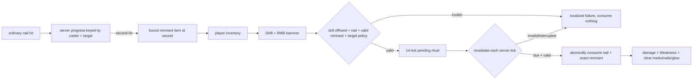

# Straw Doll Resonance

← [[00-MOC]] · [[Nobara-overview]] · [[Target-marks-and-resonance]] · [[../04-client-vfx/Hairpin-effects]]

## Design boundary

The canonical invariant is a meaningful target link, an effigy/proxy, and a nail driven by Nobara's hammer so the curse manifests remotely. Hairpin is a separate extension that detonates energy from placed nails. The research evidence is recorded in `docs/research/2026-07-10-nobara-straw-doll-canon.md:24-50,127-152,208-220`.

The first Minecraft slice therefore requires a physical, target-bound remnant plus the reusable straw doll. Ordinary marks remain Hairpin pressure and do not count as the whole Resonance link.

| Rule | Classification | Reason |
|---|---|---|
| meaningful target link + effigy/proxy + nail/hammer strike | VERIFIED canon invariant | repeated primary scenes in the research note |
| no line of sight once a valid link exists | VERIFIED canon behavior | remote canon finishes |
| Hairpin remains separate from Resonance | VERIFIED canon distinction | placed-nail detonation does not require the doll |
| every second ordinary nail hit drops one remnant | Minecraft adaptation | deterministic, legible acquisition; canon has no drop rate |
| remnant is consumed on successful impact | Minecraft balance rule | anti-abuse; canon does not prove universal consumption |
| one nail is consumed; hammer and doll remain | Minecraft balance rule | finite ammunition with reusable ritual tools |
| 14-tick wind-up | Minecraft timing adaptation | short interruptible commitment; canon has no universal duration |
| target must be alive, loaded, same dimension, and within 64 blocks | multiplayer safety adaptation | canon has no numeric/cross-world/offline rule |

## Authoritative flow

`ProjectJjkStrawDollRuntime.onOrdinaryNailHit` records only accepted ordinary damage hits and drops a typed `resonance_remnant` at the wound on the second hit (`ProjectJjkNobaraRuntime.java:148-153`; `ProjectJjkStrawDollRuntime.java:60-86`). Invulnerable/rejected damage, explosive impacts, and self-hits do not advance marks or remnant progress (`ProjectJjkRitualPolicy.java:45-47`). The item stores target UUID, dimension, and display name through persistent/network-synchronized `resonance_target` (`ProjectJjkResonanceRemnant.java:14-28`; `JujutsuDataComponents.java:10-20`).

`tryStart` accepts only main-hand hammer use. The candidate must match a remnant in inventory, the doll must be in the offhand, a nail must exist, the target must be alive and loaded in the caster's current dimension, the distance must be finite and at most 64 blocks, and that caster must not already be casting (`ProjectJjkStrawDollRuntime.java:88-112,139-203`; `ProjectJjkRitualPolicy.java:3-54`). Line of sight is deliberately absent.

The runtime revalidates the same state every server tick throughout the 14-tick wind-up. A disconnect, caster death, target death/unload, or server stop clears pending state/progress, so partial caster-target pairs cannot accumulate after entity unload (`ProjectJjkStrawDollRuntime.java:45-57`). Only the successful impact locates both exact resources and shrinks them together before applying gameplay (`ProjectJjkStrawDollRuntime.java:112-133,208-272`).

## Resolution and feedback

On successful impact the server:

- consumes one matching remnant and one nail;
- applies profile-defined Resonance damage and Weakness;
- consumes target marks, discards owned embedded nails, and clears the glowing mark;
- emits separate caster-side `DOLL_STRIKE` and target-side `RESONANCE_RELEASE` cues.

Remnant acquisition and ritual binding have their own `REMNANT_DROP` and `RITUAL_BIND` cues. These four cues carry every transient ritual particle/sound/world/HUD/camera/blur composition through VFX Core; the common runtime contains no direct ritual `sendParticles`, `playSound`, or old `spawnResonanceStrike` call. Gameplay remains on the server (`ProjectJjkStrawDollRuntime.java:208-240`; `NobaraVfxIds.java:17-20`; guard `ProjectSanityTest.java:481-484`).

## Original doll asset

The reusable item is a compact asymmetric bundled-straw effigy with dark bindings, a readable torso strike area, and tapered/split limbs. It is original project work, not a copied ProjectJJK/anime asset.

| Asset | Source |
|---|---|
| editable Blockbench source | `src/main/resources/source-assets/blockbench/straw_doll.bbmodel` |
| runtime geometry | `assets/jujutsumod/geckolib/models/straw_doll.geo.json` |
| idle / ritual raise / impact / release | `assets/jujutsumod/geckolib/animations/straw_doll.animation.json` |
| deterministic original texture source | `source-assets/blockbench/generate_straw_doll_textures.ps1` |
| runtime texture | `assets/jujutsumod/textures/item/straw_doll.png` |
| headless preview renderer | `source-assets/blockbench/render_straw_doll_preview.py` |

The Blockbench MCP creation tools were unavailable during initial authoring, so the editable `.bbmodel`, runtime GeckoLib resources, deterministic texture, and three headless preview angles were authored directly. After the user launched Blockbench, the source project was opened and inspected in the live app: all 25 runtime cubes are present in the outliner, the portable relative texture resolves, the 64x64 UV layout displays, the model-issues counter is clear, and `idle` (2.0s), `ritual_raise` (0.7s), `impact` (0.18s), and `release` (0.45s) expose editable timeline keyframes. The source contains 14 animator bone tracks (`straw_doll.bbmodel:11-202`). This proves Blockbench source integrity, not in-game rendering.

## Verification status

- Pure remnant progress/component and ritual-policy tests are wired into `check`.
- `ProjectSanityTest` guards runtime registration, resource completeness, the four cue IDs/recipes, and the removal of the mark-only shortcut.
- The same guard enforces source/runtime cube/animation parity, portable texture resolution, box-UV bounds, minimum one-unit Box UV faces, texture-backed previews, and absence of packaged ProjectJJK doll copies (`ProjectSanityTest.java:495-563`).
- Compilation/build proves source/resource integration only.
- In-game acquisition, inventory presentation, interruption feel, remote hit timing, reduced-particle readability, and two-client observation remain **UNKNOWN** until manual QA.

---
tags: #jujutsumod #nobara #resonance #straw-doll #server-authority #verified
