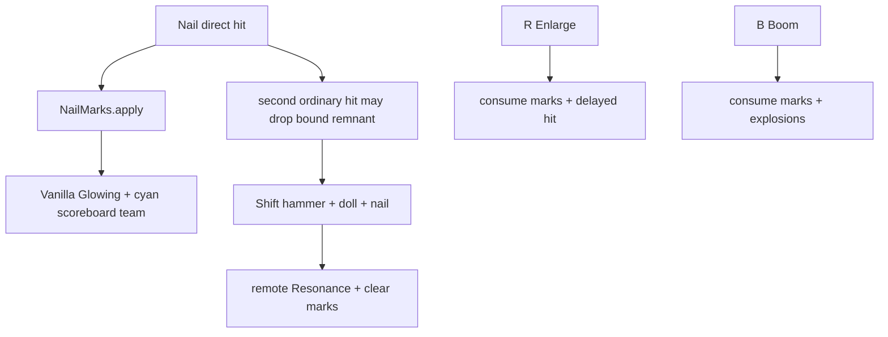

# Target Marks & Resonance

← [[00-MOC]] · [[Nobara-runtime-flow]] · [[Straw-Doll-resonance]]

## Marks manager

**Source:** `ProjectJjkNailMarks.java`  
**Status:** VERIFIED

| Method | Behavior | Status |
|---|---|---|
| `marks` | active count for target UUID at gameTime | VERIFIED |
| `apply` | add stack up to max, refresh duration | VERIFIED |
| `consume` | read+clear for detonation math | VERIFIED |
| `clear` | wipe target | VERIFIED |
| `pruneExpired` | GC expired stacks | VERIFIED |

Constants from `ProjectJjkNobaraProfile`:

- `MARK_MAX_PER_TARGET = 4`
- `MARK_DURATION_TICKS = 900`

## markTarget visual

Target marks are no longer a custom client shell/payload. Current implementation uses Minecraft's real `MobEffects.GLOWING` plus a temporary scoreboard team color for cursed-energy cyan.

| Claim | Source | Status |
|---|---|---|
| Marks apply through `ProjectJjkNailMarks.apply`. | `ProjectJjkRitualRuntime.java` | VERIFIED |
| Target mark visual uses `MobEffects.GLOWING`. | `ProjectSanityTest.java:245-253` | VERIFIED |
| Glow color is cyan/aqua via scoreboard team. | `ProjectSanityTest.java:246-248` | VERIFIED |
| Previous scoreboard team is remembered and restored. | `ProjectSanityTest.java:249-253` | VERIFIED |
| Expired/consumed marks clear glow/team state. | `ProjectSanityTest.java:250-253` | VERIFIED |

Removed old path: `ProjectJjkTargetMarkPayload` / `TargetMarkRenderManager` is not the current mark-render architecture.

## Resonance boundary

The old in-memory `ProjectJjkResonanceLink` and mark-only `ProjectJjkRitualRuntime.performResonance` path are removed. Marks do not establish full Straw Doll Resonance by themselves.

The current link is a physical `resonance_remnant` carrying the target UUID, dimension, and display name through the `resonance_target` item component. It is earned from ordinary nail hits, then consumed with a nail only after a valid doll/hammer ritual resolves. See [[Straw-Doll-resonance]].

## When marks clear

| Event | Source | Status |
|---|---|---|
| consume on detonate/enlarge path | `consume` / `consumeAnchorMarks` | VERIFIED |
| explicit clear glow/team helper | `clearGlowingMark` | VERIFIED |
| prune expired marks periodically | `pruneGlowingMarks` | VERIFIED |
| server stop restores temporary glow teams | `restoreAllGlowTeams` | VERIFIED |

## Embedded nails cleanup

Embedded nails are discarded when their linked mark/finisher path consumes them. The real nail entity still owns its embed lifetime and body-space anchor separately.

---
tags: #jujutsumod #marks #resonance #verified
