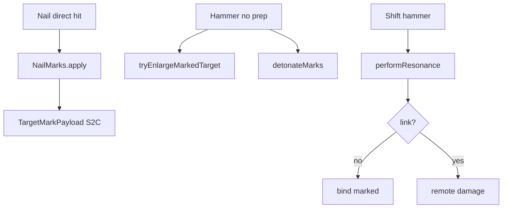

# Target Marks & Resonance

← [[00-MOC]] · [[Nobara-runtime-flow]]

## Marks manager

**Source:** `ProjectJjkNailMarks.java`  
**Status:** VERIFIED

| Method | Line | Behavior |
|---|---:|---|
| `marks` | 19 | active count for target UUID at gameTime |
| `apply` | 28 | add stack up to max, refresh duration |
| `consume` | 34 | read+clear for detonation math |
| `clear` | 42 | wipe target |
| `pruneExpired` | 47 | GC expired stacks |

Constants from Profile:

- `MARK_MAX_PER_TARGET = 4` (`:24`)
- `MARK_DURATION_TICKS = 900` (`:25`)

## markTarget (ritual)

**Source:** `ProjectJjkRitualRuntime.java:69-83`  
**Status:** VERIFIED

1. `ProjectJjkNailMarks.apply`
2. broadcast `ProjectJjkTargetMarkPayload(targetId, marks, expiresGameTime)`
3. snap/warn particles + sizzle sound

## Client mark render

**Source:** `TargetMarkRenderManager` (client) + payload handler in `JujutsuClientNetworking`  
**Status:** VERIFIED path exists

## Resonance link

**Source:** `ProjectJjkResonanceLink.java`  
**Status:** VERIFIED

| Method | Line |
|---|---:|
| `bind` | 16 |
| `get` | 20 |
| `isValid` | 24 |
| `clear` | 29 |

`performResonance` (`RitualRuntime:92`):

- if no valid link → find marked target / bind (message `resonance.bound` / `no_target`)
- if linked → remote damage `resonanceDamage(marks)`, weakness ticks, clear link/marks, impulse VFX

Ranges: `RESONANCE_RANGE=96`, `LINK_RANGE=32` (Profile `:47-48`).

## When marks clear

| Event | Source | Status |
|---|---|---|
| consume on detonate/enlarge path | `consume` / `consumeAnchorMarks` | VERIFIED |
| clearTargetMark | `RitualRuntime:455` | VERIFIED |
| pruneExpired periodic | tick every 64g | VERIFIED |
| disconnect | resonance link clear on disconnect | VERIFIED register |

## Embedded nails cleanup

Helpers: `discardOwnedEmbeddedNails` (`:428-443`) when explosions resolve.

---
tags: #jujutsumod #marks #resonance
