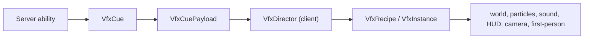

# VFX Core — Nobara Reference Implementation

← [[00-MOC]] · [[Hairpin-effects]] · [[../02-architecture/Networking]] · [[../02-architecture/Client-server-boundaries]] · [[../05-reference/Public-api-surface]]

Prefix: `.worktrees/nobara-cinematic-slice/` on branch `codex/nobara-cinematic-slice`.

## Purpose

VFX Core is the only transient combat-effect path. A server-confirmed ability emits a typed `VfxCue`, the Fabric S2C payload carries it, and the client-only director turns it into a short Java recipe. Future agents add an ID, a server cue, one recipe, tests, and documentation — not a packet switch, render callback, HUD singleton, camera mixin, and particle helper per effect.

## Shared contract

| Type | Responsibility | Source | Status |
|---|---|---|---|
| `VfxCue` | effect ID, world origin, optional entity ID anchor, intensity, server game time, seed | `vfx/VfxCue.java:6-14` | VERIFIED |
| `VfxCuePayload` | typed S2C serialization of exactly one cue | `network/VfxCuePayload.java:9-40` | VERIFIED |
| `JujutsuNetworking.broadcastVfxCue` / `sendVfxCue` | radius-filtered or direct server send, both capability-gated | `network/JujutsuNetworking.java:38-60` | VERIFIED |
| `VfxAnchorResolver` | use a live client anchor when present, otherwise the immutable cue origin | `vfx/VfxAnchorResolver.java:9-15`; `client/vfx/VfxWorldChannel.java:34-69` | VERIFIED |
| `VfxTimeline` | calculate late-packet age, admit opening beats only while age is `< 2` ticks, offset realtime clocks, and reject expired instances | `vfx/VfxTimeline.java:10-27`; `VfxTimelineTest.java:17-43` | VERIFIED |

The cue is visual-only. It never carries damage, marks, cooldowns, entity spawning, or other gameplay authority.

## Client director

`VfxDirector` is initialized once from `JujutsuModClient`, then Nobara registers recipes before client packet receivers. It owns a 64-instance bound, unknown-ID warning-once behavior, expiry cleanup, the one `AFTER_ENTITIES` world callback, and the HUD callback. It tracks `ClientLevel` by object identity: a changed level clears every active instance/channel before rebinding, while `level == null` and disconnect both clear and reset the tracked level to `null` (`VfxDirector.java:25-148`).

For every non-expired late cue, the director computes and passes the actual `initialAgeTicks` into the recipe (`VfxDirector.java:59-82`). Nobara recipes suppress elapsed one-shot sound/particle opening beats at age `>= 2` ticks but pass the age into all 15 HUD, camera/FOV, and first-person starts, whose realtime timestamps are offset instead of restarting from zero (`NobaraVfxRecipes.java:37-189`; `VfxTimeline.java:18-27`). World impact geometry remains active for the cue's remaining server-time phase. Each render resolves the retained cue's current entity anchor and falls back to `cue.origin()` after despawn (`VfxWorldChannel.java:34-69`). The first-person snap lasts `0.75s` and traverses the complete `0..15` phase scale (`VfxFirstPersonChannel.java:14-59`; guard `ProjectSanityTest.java:380-393`).

| Channel | Role | Source | Status |
|---|---|---|---|
| World | transient rings, ribbons, blades with per-render live-anchor resolution | `client/vfx/VfxWorldChannel.java:34-69` via `VfxDirector.java:101-103` | VERIFIED |
| Particles | density-scaled local burst/ring helpers | `VfxParticleChannel.java`, `VfxContext.java:76-83` | VERIFIED |
| Sound | local no-falloff SFX | `VfxSoundChannel.java`, `VfxContext.java:92-94` | VERIFIED |
| HUD | impact/swing flash and vignette | `VfxHudChannel.java`, `VfxDirector.java:47,105-107` | VERIFIED |
| Camera/FOV | narrow existing camera/game renderer mixins read director offsets | `HairpinCameraMixin.java:26-27`, `HairpinGameRendererMixin.java:15` | VERIFIED |
| First person | 0.75-second snap over the full `0..15` phase; narrow existing hand mixin reads the director pose | `VfxFirstPersonChannel.java:14-59`, `NobaraFirstPersonSnapMixin.java:24` | VERIFIED |

`VfxQuality` maps the vanilla particle setting to full, reduced (0.58), and minimal (0.28) density. Individual recipes use proximity to omit local spectacle at distance. Quality and culling only change client rendering, never cue delivery or gameplay.

## Agent authoring contract

Required path: **stable ID -> server-confirmed cue -> client recipe -> automated and in-game verification**.

1. Add a stable `ResourceLocation` to an appropriate `*VfxIds` class.
2. At the server-confirmed gameplay point, build a `VfxCue` with server game time and a server seed, then call `JujutsuNetworking.broadcastVfxCue` or `sendVfxCue`.
3. Add a `VfxRecipe` registration. The recipe returns a `VfxInstance`; its starter receives `VfxContext` and uses only director channels.
4. Add assertion coverage for ID/registration and any new pure timeline/anchor policy.
5. Update this note, the character VFX note, MOC, and affected networking/boundary docs.

### Forbidden shortcuts

- Do **not** register a packet receiver per effect.
- Do **not** couple an ability directly to a renderer, client channel, render callback, or static VFX manager; the ability emits only a cue.
- Do **not** register `WorldRenderEvents`, HUD callbacks, or a new mixin from a recipe.
- Do **not** mutate gameplay state or send packets from the client recipe.
- Do **not** reintroduce `ProjectJjkNobaraImpulsePayload` or the removed Hairpin static managers.
- Do **not** add a JSON/DSL editor, preview mode, generic GeckoLib bone attachment, or shader dependency in V1.

A later shader/post-process spike may add an internal backend behind the director only after a compatible Fabric 1.21.8 route is independently validated. It is not an authoring API today.

## Nobara reference scenes

| Scene | IDs | VFX language | Status |
|---|---|---|---|
| Hammer / launch | `hammer`, `impact`, `impact_sound` | forged-metal beat, cyan-white hit, camera/HUD response | VERIFIED |
| Resonance / link | `resonance_channel`, `resonance_strike`, `link_bind`, `detonate` | cursed-energy pulse, binding ring, particle burst, target-origin timing | VERIFIED |
| Enlarge / Boom | `enlarge`, `explosion`, `first_person_snap` | cyan rings, ribbons/blades, shards, sound stack, HUD/camera, caster hand snap | VERIFIED |

All ten IDs are registered in `NobaraVfxRecipes.java:23-34`. `ProjectJjkNailRenderer` remains state-driven for persistent real nail aura and shares `VfxPalette`; it is deliberately not forced into a transient timeline.

## Verification

- Pure assertion tasks cover cue codec/seed, timeline age/expiry/opening-window/realtime offsets, anchor fallback, quality scaling, registration, transport guards, lifecycle cleanup, all 15 age-aware timed-channel calls, and legacy-path absence.
- `ProjectSanityTest.java:303-393` prevents an accidental return to the old payload/static-manager path and checks the current timeline, lifecycle, live-anchor, and first-person wiring; legacy absence assertions are at `ProjectSanityTest.java:372-377`.
- On 2026-07-10, `check` and `build --no-daemon -x test` were successful and all seven assertion tasks passed.
- Standard Gradle `runClient` was blocked by Windows system commit limit `errno=1455`. A terminal-only direct launch of the same generated Loom client config, without a Gradle daemon and with `-Xms128m -Xmx1024m`, reached `JujutsuMod initialized`, LWJGL, OpenAL, resource reload, and atlas creation. `logs/2026-07-10-1.log.gz` contained no `ERROR`/`FATAL`; the process was intentionally stopped with Ctrl+C. This was startup smoke, not gameplay QA.
- Built and installed runtime jars are both 2,102,209 bytes with SHA-256 `19A943FFEAED46D55EBBD7F775828499E5DDFA44485339B2ED8802B33F87EE15`.
- Hammer/launch, resonance/link, Enlarge/Boom, live anchor death/despawn, reduced particles, and two-client observation remain **UNKNOWN** because UI automation was explicitly prohibited. A startup log is not gameplay verification.

---
tags: #jujutsumod #vfx #nobara #architecture #verified
