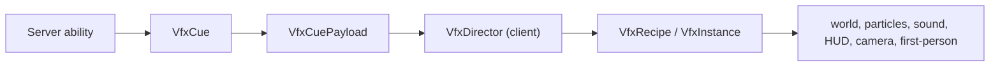

# VFX Core - Nobara Reference Implementation

<- [[00-MOC]] | [[Hairpin-effects]] | [[../02-architecture/Networking]] | [[../02-architecture/Client-server-boundaries]] | [[../05-reference/Public-api-surface]]

Source: repository root, main branch.

## Purpose

VFX Core is the only transient combat-effect path. A server-confirmed ability emits a typed `VfxCue`, the Fabric S2C payload carries it, and the client-only director turns it into a short Java recipe. Future agents add an ID, a server cue, one recipe, tests, and documentation - not a packet switch, render callback, HUD singleton, camera mixin, and particle helper per effect.

## Shared contract

| Type | Responsibility | Source | Status |
|---|---|---|---|
| `VfxCue` | effect ID, immutable world-origin fallback, optional entity ID anchor, world-space anchor offset, intensity, server game time, seed, direction (normalized attack vector or ZERO) | `vfx/VfxCue.java` | VERIFIED |
| `VfxCuePayload` | typed S2C serialization of exactly one cue | `network/VfxCuePayload.java` | VERIFIED |
| `JujutsuNetworking.broadcastVfxCue` / `sendVfxCue` | radius-filtered or direct server send, both capability-gated | `network/JujutsuNetworking.java:43-65` | VERIFIED |
| `VfxAnchorResolver` | resolve a live anchor as `anchor position + anchorOffset`, otherwise use the immutable cue origin | `vfx/VfxAnchorResolver.java` | VERIFIED |
| `VfxTimeline` | calculate late-packet age, admit opening beats only while age is < 2 ticks, offset realtime clocks, and reject expired instances | `vfx/VfxTimeline.java` | VERIFIED |

The cue is visual-only. It never carries damage, marks, cooldowns, entity spawning, or other gameplay authority.

Anchor semantics are explicit. Unanchored cues use `VfxCue.NO_ANCHOR` with `Vec3.ZERO`. Anchored server cues store `origin.subtract(anchor.position())`; while the entity exists, the client resolves `anchor.position().add(cue.anchorOffset())`. If the entity is missing or despawned, resolution returns the original immutable `cue.origin()`. This preserves eye/center displacement while an anchor moves without introducing local-space rotation, bones, or attachment types.

## Client director

`VfxDirector` is initialized once from `JujutsuModClient`, then Nobara registers recipes before client packet receivers. It owns a 64-instance bound, unknown-ID warning-once behavior, expiry cleanup, the one `AFTER_ENTITIES` world callback, and the HUD callback. It tracks `ClientLevel` by object identity: a changed level clears every active instance/channel before rebinding, while `level == null` and disconnect both clear and reset the tracked level to `null`.

For every non-expired late cue, the director computes and passes the actual `initialAgeTicks` into the recipe. Nobara recipes suppress elapsed one-shot sound/particle opening beats at age >= 2 ticks but pass the age into all 40 HUD, camera/FOV, first-person, and post-process starts, whose realtime timestamps are offset instead of restarting from zero. World impact geometry remains active for the cue's remaining server-time phase. Each render resolves the retained cue's current entity anchor plus its world-space offset and falls back to `cue.origin()` after despawn. The first-person snap lasts 0.75s and traverses the complete 0..15 phase scale.

| Channel | Role | Status |
|---|---|---|
| World | transient rings, ribbons, blades with per-render live-anchor resolution | VERIFIED |
| Particles | density-scaled local burst/ring helpers | VERIFIED |
| Sound | local no-falloff SFX | VERIFIED |
| HUD | impact/swing flash, vignette, and target-local nausea overlay | VERIFIED |
| Camera/FOV | narrow existing camera/game renderer mixins read director offsets | VERIFIED |
| Time | bounded client render partial-tick dilation for confirmed cinematic hit-stop | VERIFIED (infrastructure only; no recipe currently triggers it) |
| First person | 0.75-second snap over the full 0..15 phase; narrow existing hand mixin reads the director pose | VERIFIED |
| Post-process | age-aware vanilla blur requested only by recipes and rendered by the director; runtime/linkage failure disables blur for the client session while all shaderless channels continue | VERIFIED |

`VfxQuality` maps the vanilla particle setting to full, reduced (0.58), and minimal (0.28) density. Individual recipes use proximity to omit local spectacle at distance. Quality and culling only change client rendering, never cue delivery or gameplay.

## Nobara VFX IDs (25 total)

**Source:** `src/main/java/jujutsu/mod/vfx/NobaraVfxIds.java:7-31`

| ID | Scene |
|---|---|
| `hammer` | Hammer / launch |
| `impact` | Hammer / launch |
| `impact_sound` | Hammer / launch |
| `hammer_horizontal` | Hammer variant |
| `hammer_overhead` | Hammer variant |
| `hammer_nail_launch` | Hammer variant |
| `embedded_nail_drive` | Hammer variant |
| `resonance_channel` | Resonance / link |
| `resonance_strike` | Resonance / link |
| `link_bind` | Resonance / link |
| `detonate` | Resonance / link |
| `enlarge` | Enlarge / Boom |
| `explosion` | Enlarge / Boom |
| `first_person_snap` | Enlarge / Boom |
| `remnant_drop` | Straw Doll ritual |
| `ritual_bind` | Straw Doll ritual |
| `doll_strike` | Straw Doll ritual |
| `resonance_release` | Straw Doll ritual |
| `black_flash` | Black Flash |
| `self_resonance` | Self Resonance |
| `nail_deepen` | Nail depth |
| `nail_trap_placed` | Nail Trap |
| `nail_trap_armed` | Nail Trap |
| `nail_trap_collapse` | Nail Trap |
| `nail_trap_impact` | Nail Trap |

All 25 IDs have registered Java recipes in `NobaraVfxRecipes`.

## Nobara reference scenes

| Scene | IDs | VFX language | Status |
|---|---|---|---|
| Hammer / launch | `hammer`, `impact`, `impact_sound`, `hammer_horizontal`, `hammer_overhead`, `hammer_nail_launch`, `embedded_nail_drive` | forged-metal beat, cyan-white hit, camera/HUD response | VERIFIED |
| Resonance / link | `resonance_channel`, `resonance_strike`, `link_bind`, `detonate` | cursed-energy pulse, binding ring, particle burst, target-origin timing | VERIFIED |
| Enlarge / Boom | `enlarge`, `explosion`, `first_person_snap` | cyan rings, ribbons/blades, shards, sound stack, HUD/camera, caster hand snap | VERIFIED |
| Straw Doll ritual | `remnant_drop`, `ritual_bind`, `doll_strike`, `resonance_release` | trace pickup, constricting bind, caster-visible slow/zoom/nausea, dark-center/cyan-fracture remote release | VERIFIED |
| Black Flash | `black_flash` | directional slash blades + seeded lightning discharge + shockwave ring (world), BF custom particles, 4-layer sound stack, aggressive camera shake (270ms), white HUD flash + nausea, blur, first-person snap (caster only), GeckoLib animation trigger | VERIFIED |
| Self Resonance | `self_resonance` | cursed pulse, self-damage vignette, linked target burst | VERIFIED |
| Nail depth | `nail_deepen` | drive-in particle burst, depth ring | VERIFIED |
| Nail Trap | `nail_trap_placed`, `nail_trap_armed`, `nail_trap_collapse`, `nail_trap_impact` | placement marker, arm glow, collapse ring, impact burst | VERIFIED |

`ProjectJjkNailRenderer` remains state-driven for persistent real nail aura, renders a compressed-energy envelope around prepared/flying nails, and shares `VfxPalette`; embedded nails deliberately have no broad aura. Gameplay ownership for these cues is documented in [[../03-systems/Nobara-runtime-flow]].

## Agent authoring contract

Required path: **stable ID -> server-confirmed cue -> client recipe -> automated and in-game verification**.

1. Add a stable `ResourceLocation` to an appropriate `*VfxIds` class.
2. At the server-confirmed gameplay point, build a `VfxCue` with server game time and a server seed, then call `JujutsuNetworking.broadcastVfxCue` or `sendVfxCue`. Use `Vec3.ZERO` for an unanchored cue; for an entity anchor store `origin.subtract(anchor.position())`.
3. Add a `VfxRecipe` registration. The recipe returns a `VfxInstance`; its starter receives `VfxContext` and uses only director channels.
4. Add assertion coverage for ID/registration and any new pure timeline/anchor policy.
5. Update this note, the character VFX note, MOC, and affected networking/boundary docs.

### Forbidden shortcuts

- Do **not** register a packet receiver per effect.
- Do **not** couple an ability directly to a renderer, client channel, render callback, or static VFX manager; the ability emits only a cue.
- Do **not** register `WorldRenderEvents`, HUD callbacks, or a new mixin from a recipe.
- Do **not** mutate gameplay state or send packets from the client recipe.
- Do **not** reintroduce `ProjectJjkNobaraImpulsePayload` or the removed Hairpin static managers.
- Do **not** add a JSON/DSL editor, preview mode, generic GeckoLib bone attachment, or external shader dependency in V1.

Post-process is intentionally a narrow internal channel, not an authoring framework. Recipes may request the existing age-aware blur, but must keep world/HUD/camera/particle composition complete when blur disables itself.

## Verification

- Pure assertion tasks cover cue codec/seed/anchor offset/direction, timeline age/expiry/opening-window/realtime offsets, zero/non-zero live-anchor resolution, immutable-origin fallback, quality scaling, registration, transport guards, lifecycle cleanup, all 40 age-aware timed-channel calls, blur fallback wiring, caster-visible and target-local time/HUD wiring, straw-doll resource completeness, and legacy-path absence.
- `ProjectSanityTest` prevents an accidental return to the old payload/static-manager path and checks the current timeline, lifecycle, live-anchor, and first-person wiring.
- Hammer/launch, Straw Doll acquisition/ritual, Enlarge/Boom, live anchor death/despawn, blur availability, reduced particles, and two-client observation remain **UNKNOWN** because UI automation is prohibited. Compilation and startup logs are not gameplay verification.

---
tags: #jujutsumod #vfx #nobara #architecture #verified
